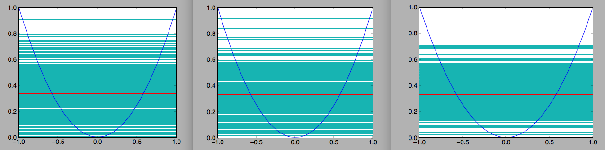
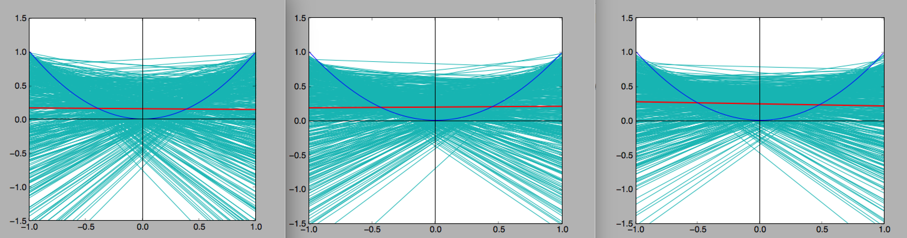

#machine learning midterm

##Bias and Variance trade-off

    Target function : f(x) = x ^ 2

    Datasets : {{x1,x1^2},{x2,x2^2}...}

    Model 1 : h(x) = a (horizontal line model)

    Model 2 : h(x) = ax + b (linear model)

    *Q* : Work out the bias and variance for both models. Also find out the bias and variance when there are four data points per dataset.

##Runing sample
    
    

